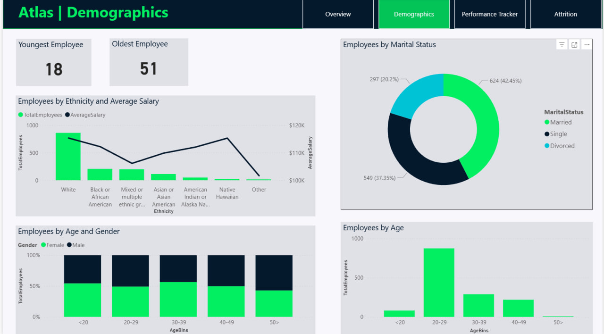
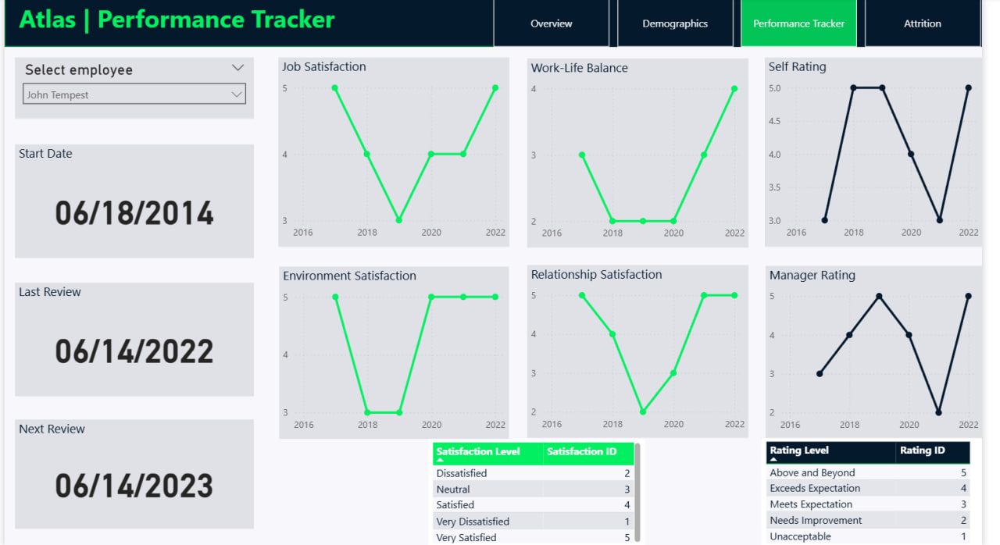
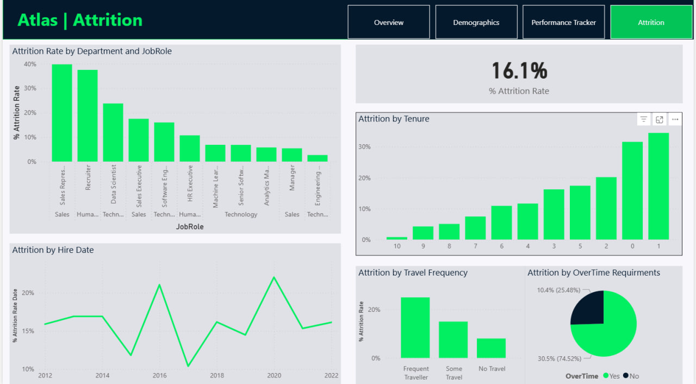

# HR Analytics

An HR analytics project using Power BI to explore employee data, workforce characteristics, performance, and employee attrition through an interactive multi-page dashboard.

## Project Overview

This project analyzes employee data and transforms it into an interactive Power BI dashboard consisting of four dedicated analytical pages.

Each page focuses on a different aspect of HR analytics, allowing users to explore the workforce from multiple perspectives and gain a clearer understanding of employee-related patterns and key HR metrics.

## Dashboard Pages

### 1. Overview

Provides a high-level summary of the organization's workforce through key HR metrics and performance indicators.

### 2. Demographics

Explores the demographic characteristics of employees and provides insights into workforce composition and distribution.

### 3. Performance Tracker

Focuses on employee performance and related indicators, helping analyze workforce performance across different dimensions.

### 4. Attrition

Analyzes employee attrition patterns and explores factors related to employee turnover.

## Objective

The goal of this project was to use Power BI to transform employee data into an interactive HR analytics solution that provides meaningful insights into workforce composition, employee performance, and attrition.

## Tools & Technologies

* Power BI
* Power Query
* DAX
* Data Modeling
* Data Visualization

## Analysis Process

### 1. Data Preparation

Prepared and structured the employee dataset for analysis in Power BI.

### 2. Data Transformation

Used Power Query to clean and transform the data and prepare it for analysis.

### 3. Data Modeling

Developed the data model required to analyze employee information and HR-related metrics.

### 4. Data Analysis

Created DAX measures and analyzed the employee data to develop relevant HR metrics and performance indicators.

### 5. Dashboard Development

Developed a four-page interactive Power BI dashboard covering Overview, Demographics, Performance Tracker, and Attrition.

## Dashboard Preview

### Overview

### Demographics

### Performance Tracker

### Attrition

## Key Insights

The dashboard provides insights into workforce composition, employee demographics, performance patterns, and attrition.

Specific findings and metrics are presented through the interactive dashboard pages.

## Project Files

* `dashboard/` — Screenshots of the four Power BI dashboard pages
* `data/` — Dataset used for the analysis, if redistribution is permitted
* `README.md` — Project documentation

## Project Outcome

This project demonstrates practical experience using Power BI to transform employee data into a structured HR analytics solution.

It showcases skills in data preparation, data transformation, data modeling, DAX, KPI development, and interactive dashboard development.

## Author

**M. Zain Kabbany**

Junior Data Analyst
