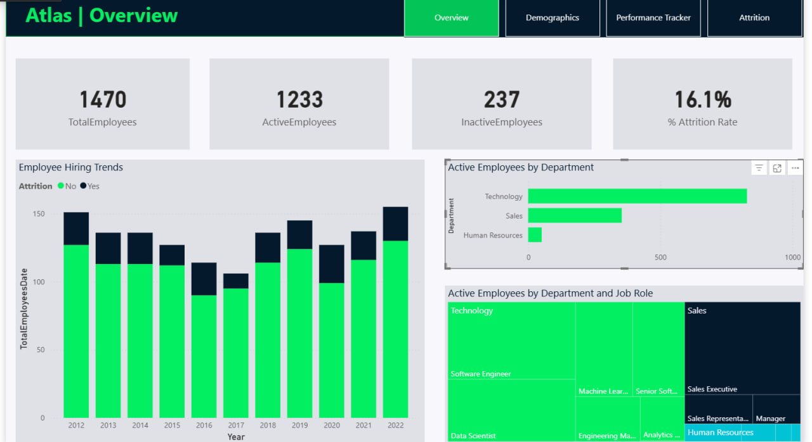

# HR Analytics

An HR analytics project using Power BI to explore employee data, workforce patterns, and key HR performance indicators.

## Project Overview

This project analyzes employee data and transforms it into an interactive Power BI dashboard.

The analysis explores workforce characteristics and HR-related metrics to provide a clearer understanding of employee data and organizational patterns.

## Objective

The goal of this project was to use Power BI to analyze employee data, identify meaningful workforce patterns, and present key HR metrics through an interactive dashboard.

## Analysis Areas

* Employee demographics
* Workforce distribution
* Employee performance indicators
* Workforce patterns
* HR KPIs
* Employee-related trends
* Data-driven HR insights

## Tools & Technologies

* Power BI
* Power Query
* DAX
* Data Modeling
* Data Visualization

## Analysis Process

### 1. Data Preparation

Prepared and structured the employee dataset for analysis in Power BI.

### 2. Data Transformation

Used Power Query to clean and transform the data and prepare it for analysis.

### 3. Data Modeling

Developed the data model required to analyze employee information and HR-related metrics.

### 4. Data Analysis

Created DAX measures and analyzed the employee data to identify relevant HR metrics and workforce patterns.

### 5. Dashboard Development

Developed an interactive Power BI dashboard using KPIs, charts, and visualizations to communicate the results of the analysis.

## Dashboard Preview

### HR Analytics Dashboard

## Project Files

* `dashboard/` — Power BI dashboard screenshots
* `data/` — Dataset used for the analysis, if redistribution is permitted
* `README.md` — Project documentation

## Project Outcome

This project demonstrates the use of Power BI to transform employee data into meaningful HR analysis and interactive visualizations.

It showcases practical experience in data preparation, data transformation, data modeling, DAX, KPI development, and dashboard design.

## Author

**M. Zain Kabbany**

Junior Data Analyst

